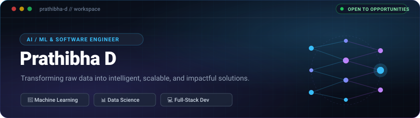

  

  

## 👤 About Me

I am a Computer Science Engineering student specializing in AI/ML and Full-Stack Development. I build practical applications that combine machine learning with modern web technologies. My projects include fraud detection, customer churn prediction, recommendation systems, and real-time crowd management. I am currently strengthening my DSA skills and building production-ready full-stack projects.

---

## 🎯 What I Build &amp; Career Focus

- **AI &amp; Machine Learning**: Building predictive pipelines, classification models, and algorithmic solutions.
- **Data Science &amp; Analytics**: Exploratory data analysis, statistical modeling, feature engineering, and data storytelling.
- **Full-Stack Development**: Modern, responsive user interfaces integrated with robust Python backend services.
- **Intelligent Web Applications**: Merging machine learning capabilities seamlessly into web platforms.
- **Practical Real-World Software**: Engineering clean, maintainable software designed to solve concrete operational problems.

---

## 🛠️ Technical Skills

### 💻 Languages
`Python` • `Java` • `C` • `JavaScript` • `SQL`

  

### 🤖 AI / Machine Learning
- **Core ML &amp; Algorithms**: Scikit-learn, XGBoost, Random Forest, Support Vector Machines (SVM), TensorFlow
- **Techniques &amp; Methodologies**: Feature Engineering, Predictive Analytics, Statistical Analysis, SMOTE, SARIMA

  

### 📊 Data Science &amp; Analytics
- **Data Manipulation &amp; Modeling**: Pandas, NumPy, Statsmodels
- **Visualization &amp; BI**: Matplotlib, Seaborn, Power BI, Microsoft Excel

### 🌐 Web &amp; Full-Stack Development
- **Frontend**: HTML5, CSS3, JavaScript, React.js, Tailwind CSS
- **Backend &amp; APIs**: Python, Flask, REST APIs
- **Databases**: MySQL, SQL

  

### 🧰 Developer Tools &amp; Platforms
`Git` • `GitHub` • `VS Code` • `Jupyter Notebook` • `Linux`

  

---

## 📂 Featured Projects

### 🔒 [Credit Card Fraud Detection](https://github.com/Prathibha856/Credit_Card_fraud_detector)
- **Tech Stack**: `Python`, `Scikit-learn`, `Random Forest`, `SMOTE`
- **Overview**: Detects fraudulent transactions using an imbalanced-classification pipeline with SMOTE and Random Forest.

### 📈 [Customer Churn Prediction](https://github.com/Prathibha856/Customer-Churn-Prediction-Using-Machine-Learning)
- **Tech Stack**: `Python`, `Random Forest`, `XGBoost`, `Logistic Regression`, `Scikit-learn`
- **Overview**: Predicts customer churn using an ensemble pipeline combining Random Forest, XGBoost, and Logistic Regression.

### 🚌 [BusFlow — Real-Time Bus Tracking &amp; Crowd Management](https://github.com/Prathibha856/RealTimeBusTrackingCrowdManagement)
- **Tech Stack**: `Python`, `Flask`, `React.js`, `Random Forest`
- **Overview**: Full-stack ML platform for real-time bus tracking, ETA prediction, and crowd management using Flask, React.js, and Random Forest.

### 🎬 [Netflix Recommendation Engine](https://github.com/Prathibha856/Netflix_Recommendation_Engine_SVM)
- **Tech Stack**: `Python`, `SVD`, `Collaborative Filtering`, `Scikit-Surprise`
- **Overview**: Personalized movie recommendation system using collaborative filtering and Singular Value Decomposition (SVD).

### 🌌 Stellar Stories — Space Weather Visualizer
- **Tech Stack**: `React.js`, `NASA Open APIs`
- **Overview**: Interactive React.js platform using NASA Open APIs to visualize space-weather information.

### ✈️ [Flight Booking System](https://github.com/Prathibha856/Flight_Booking_Project)
- **Tech Stack**: `Python`, `Flask`, `SQL`
- **Overview**: Full-stack flight booking application with authentication, flight search, booking, cancellation, and SQL-backed data management.

---

## 📊 GitHub Analytics

  

  
  

---

## 🐍 Contribution Activity

<!-- The animated snake will be generated and served from the 'output' branch once .github/workflows/main.yml executes on GitHub. -->

  <i>Contribution snake workflow is configured via GitHub Actions.</i>

---

## 📬 Connect

  
  
  

---

  

  

